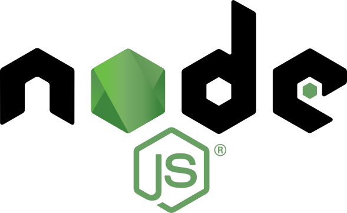

  

<h2 align="center">Curso Nodejs para Iniciantes</h2>

Esse repositório foi criado com intuito de registrar todos desafios realizados durante o curso "Nodejs para iniciantes" ministrado pelo mestre **Erick Wendel**. 

## 📢 Observações

> -  Curso gratuito e com certificado, ou seja não precisa ser pago para que seja um excenlente conteúdo.
> -  Apesar do curso ter uma grande parte formada por conceito iniciais, conta também com design patterns, deploy e code covarage com Istanbul.
> -  Ótima didática aliada com conhecimento ímpar do instrutor.
> -  Pretendo fazer mais cursos na plataforma.
> -  Disponibiliza certificado na conclusão. Ótimo para que está começando.

## ✅ Mais informações

> Basta acessar o **[site](https://cursos.erickwendel.com.br/#cursos_populares)** do curso e conferir todos cursos disponibilizados.

## 📝 Licença

Esse projeto está sob a licença MIT. Veja o arquivo [LICENSE](https://raw.githubusercontent.com/kaiorr/ew-node/master/LICENSE) para mais detalhes.

----

Feito com :heart: por **Kaio Ribeiro** :call_me_hand: [Professional Network](https://www.linkedin.com/in/kaio-ribeiro-310123150/)

